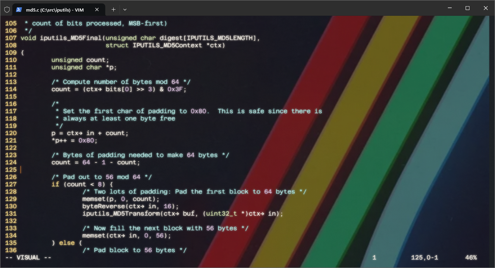

# terminal-salvage

Windows Terminal theme inspired by the Arc Raiders aesthetic — neon stripes, dark background, minimal noise.

## What's included

| File | Description |
|------|-------------|
| `settings.json` | Windows Terminal config — color scheme, font, opacity, background |
| `neon-stripes-bg.png` | Background image (mirrored neon stripe photo) |

## Setup

1. **Font** — Install [Azeret Mono](https://fonts.google.com/specimen/Azeret+Mono) (variable font)
2. **Background** — Copy `neon-stripes-bg.png` to `%USERPROFILE%\Pictures\Terminal\`
3. **Terminal settings** — Merge or replace `%LOCALAPPDATA%\Packages\Microsoft.WindowsTerminal_8wekyb3d8bbwe\LocalState\settings.json`

## Color scheme

`Arc Raiders-ish` — dark gunmetal base, amber accent, dusty teal highlights.
